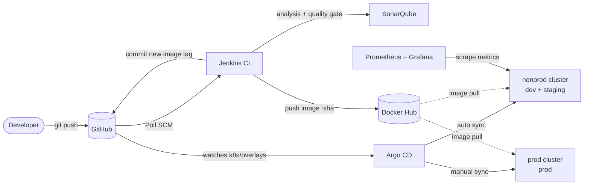
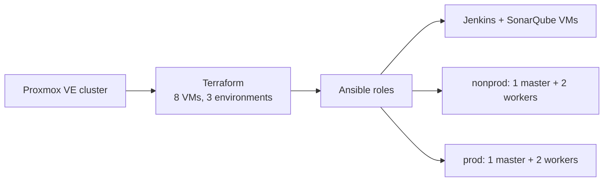

# End-to-End DevOps Platform on Proxmox VE

A complete, self-hosted CI/CD and GitOps platform built from bare VMs: infrastructure as code, configuration management, two Kubernetes clusters, a Jenkins pipeline with quality gates, Argo CD deployments across three environments, and Prometheus/Grafana monitoring.

## Architecture





## Tech stack

| Layer | Tools |
|---|---|
| Virtualization | Proxmox VE 9, Ceph RBD storage, Ubuntu 24.04 cloud-init template |
| Infrastructure as code | Terraform (bpg/proxmox provider), reusable VM module, separate state per environment |
| Configuration management | Ansible roles (common, docker, jenkins, sonarqube, k8s), Ansible Vault for secrets |
| Kubernetes | kubeadm v1.36, containerd, Calico CNI; separate nonprod and prod clusters |
| CI | Jenkins pipeline as code, Maven in containers, JUnit + JaCoCo, SonarQube quality gate |
| Containers | Multi-stage Dockerfile, non-root user, images tagged by commit SHA, Docker Hub |
| CD / GitOps | Kustomize base + overlays, Argo CD (auto-sync dev/staging, manual approval for prod) |
| Monitoring | kube-prometheus-stack via Argo CD, ServiceMonitor for app metrics, Grafana dashboards as code |
| Application | Spring Boot 4 / Java 21 REST API with Actuator health probes and Micrometer metrics |

## How a change reaches production

1. A developer pushes code to `main`.
2. Jenkins detects the commit, runs unit tests in a Maven container, and sends the analysis to SonarQube.
3. The pipeline waits for the **quality gate** (webhook callback). A failed gate stops the build.
4. Jenkins builds the image, tags it with the **commit SHA**, and pushes it to Docker Hub.
5. Jenkins commits the new tag to `k8s/overlays/dev`. **Jenkins has no cluster credentials**: it only changes Git.
6. Argo CD sees the change and rolls it out to **dev** with zero downtime (readiness probes, `maxUnavailable: 0`).
7. Promotion to **staging** is a commit to the staging overlay; it syncs automatically.
8. Promotion to **prod** is a commit plus a **manual Sync** in Argo CD, a deliberate release gate.

The same image moves through every environment; it is never rebuilt per environment.

## Environments

| Environment | Cluster | Namespace | Replicas | Sync |
|---|---|---|---|---|
| dev | nonprod | `demo-dev` | 1 | automatic, updated by CI |
| staging | nonprod | `demo-staging` | 2 | automatic, promoted by commit |
| prod | prod | `demo-prod` | 2 (spread across workers) | manual approval |

## Repository layout

```
terraform/            Reusable proxmox-vm module + shared / nonprod / prod environments
ansible/              Inventory, roles, playbooks, Vault-encrypted secrets
app/                  Spring Boot service, tests, multi-stage Dockerfile
Jenkinsfile           CI pipeline: test, scan, gate, build, push, GitOps update
k8s/base/             Deployment + Service shared by all environments
k8s/overlays/         dev, staging, prod: namespace, replicas, env, image tag
k8s/components/       Optional pieces (ServiceMonitor for dev/staging)
argocd/apps/          Argo CD Application definitions
monitoring/           Grafana dashboards as code
```

## Engineering decisions

- **Separate prod cluster:** a nonprod incident or upgrade can't affect production workloads.
- **GitOps over `kubectl apply` from CI:** every deployment is a reviewed, revertible Git commit, and drift is corrected automatically (`selfHeal`).
- **Commit-SHA image tags:** every running pod traces back to an exact commit; rollback means pointing the overlay at an earlier SHA.
- **Least privilege everywhere:** a dedicated Proxmox API token for Terraform, fine-grained GitHub token scoped to one repo, analysis-only SonarQube token, containers running as non-root with a read-only root filesystem.
- **Loop prevention:** Jenkins polling ignores commits that only touch `k8s/`, `argocd/` or `monitoring/`, so the pipeline's own GitOps commits don't retrigger it.

## Problems solved along the way

- **VMs had no network access** on a Proxmox host that also ran Docker: Docker sets the iptables `FORWARD` policy to `DROP` and loads `br_netfilter`, so bridged VM traffic was filtered. Fixed with `DOCKER-USER` rules, persisted by a systemd unit ordered after Docker.
- **`mvn sonar:sonar` failed in CI** ("no plugin found for prefix"): the shorthand only resolves through a developer's `settings.xml`. Fixed by using the plugin's full coordinates.
- **Argo CD showed the monitoring stack permanently OutOfSync:** the Grafana chart generates a random admin password on every render. Fixed by supplying a pre-created Secret through `existingSecret`.
- **Grafana dashboards were lost on restart:** moved them into Git as ConfigMaps loaded by the Grafana sidecar.

## Screenshots

| | |
|---|---|
|  |  |
|  |  |

## Roadmap

- Alerting rules (pod restarts, error rate, latency) routed through Alertmanager
- Ingress controller with TLS instead of NodePorts
- Persistent storage for Prometheus and Grafana
- Image vulnerability scanning in the pipeline
